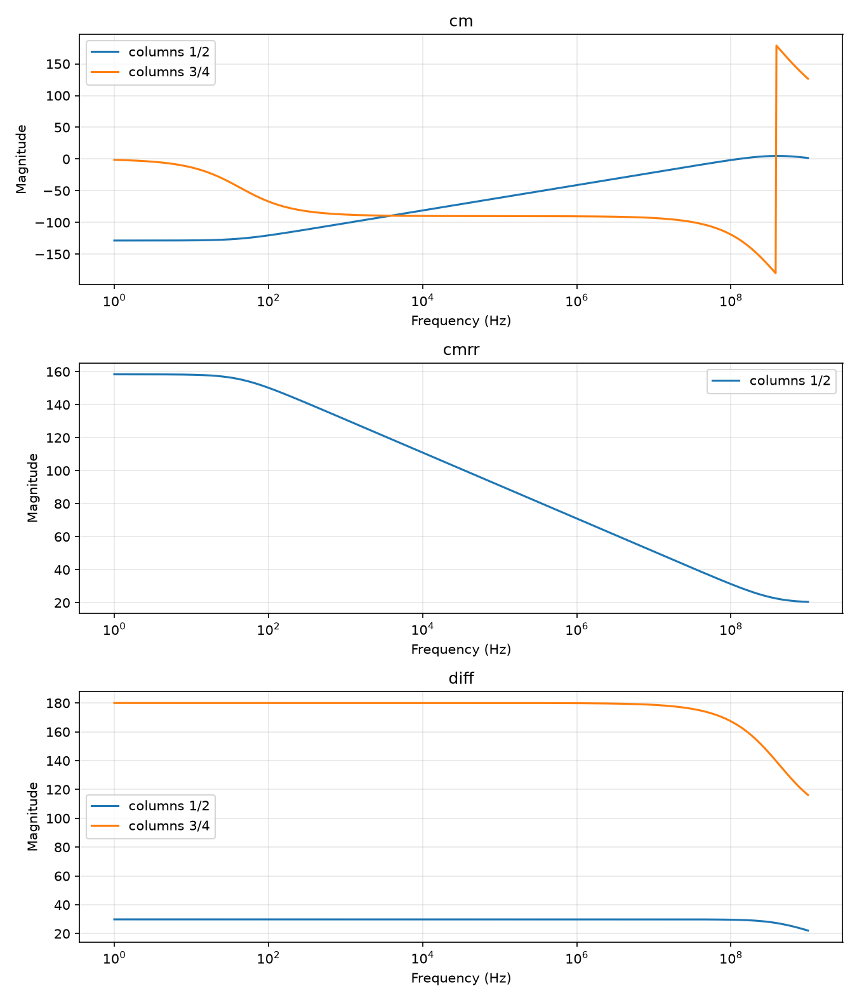

# Cascode Differential Pair in SKY130

This repository contains ngspice netlists for exploring MOSFET operating points and a cascode differential-pair amplifier using the open-source SKY130A PDK.

The examples progress from individual NMOS and PMOS devices to an ideal-tail cascode differential pair, and finally to a version with an NMOS current-source tail load. The final circuit includes differential-mode gain, common-mode gain, and CMRR analysis.

The `LimitTest/` directory extends the project with limit and robustness tests
for input common-mode range, power-supply rejection, slew rate, output swing,
temperature, and process variation.

## Requirements

- ngspice
- Python 3
- NumPy
- Matplotlib
- The SKY130A PDK installed at:

	`/usr/local/share/pdk/share/pdk/sky130A/libs.tech/ngspice/sky130.lib.spice`

The netlists use the SKY130 typical-typical (`tt`) model corner. If the PDK is installed elsewhere, update the `.lib` path in the netlists.

Install the Python plotting dependencies with:

```bash
python3 -m pip install numpy matplotlib
```

## Directory layout

```text
Diffpair/
├── IdealDiff/
│   ├── diffpair.spice       # DC operating point of the cascode pair
│   └── diff_ac.spice        # AC gain and phase response
├── MosLoad/
│   ├── Mosload.spice        # DC operating point with an NMOS tail load
│   ├── Mosload_ac.spice     # Differential/common-mode AC analysis and CMRR
│   ├── data/                # AC data written by Mosload_ac.spice
│   │   ├── cm.txt
│   │   ├── cmrr.txt
│   │   └── diff.txt
│   └── PythonPlot/
│       └── plot.py          # Plots all data files in ../data/
├── Nmos/
│   ├── bulkfloat.spice      # NMOS operating-point parameters
│   └── log.txt              # Saved NMOS results used for sizing
├── Pmos/
		└── pmos.spice           # PMOS operating-point parameters
└── LimitTest/
	├── ICMR.spice           # Input common-mode range test
	├── PSRR.spice           # Power-supply rejection test
	├── ProcessCorner.spice  # Slow process-corner operating point
	├── SlewRate.spice       # Transient slew-rate test with load capacitors
	├── Swing.spice          # Output-swing/headroom test
	├── ideal.spice          # Operating-point and AC sanity check
	├── temp.spice           # Temperature test at 125 C
	└── Data/                # Saved measurements and ngspice logs
		├── ICMR.txt
		├── PSRR.txt
		├── SlewRate.txt
		├── Swing.txt
		├── temp.txt
		├── Process_op.log
		└── ideal.log
```

## Circuit overview

The differential pair uses two cascoded NMOS input branches and PMOS cascode loads. The two inputs share the tail node `Nbias` and are biased at 1.245 V. The supply is 1.8 V.

The device multiplicities in the differential-pair netlists are based on the operating-point values recorded in `Nmos/log.txt`:

| Device role | Reference current | Approximate `gm` | Approximate `gds` |
| --- | ---: | ---: | ---: |
| Input NMOS, `L=0.15` | 0.3597 mA | 1.797 mS | 0.308 mS |
| Cascode NMOS, `L=0.15` | 0.3719 mA | 1.807 mS | 0.318 mS |
| Tail NMOS, `L=0.30` | 0.1134 mA | 0.733 mS | 0.187 mS |

## Running the simulations

The repository contains the netlists in the nested `Diffpair/` directory. Run commands from `/path/to/Diffpair/Diffpair` (the directory containing `IdealDiff/`, `MosLoad/`, `Nmos/`, and `Pmos/`).

### Individual MOSFET checks

```bash
ngspice -b Nmos/bulkfloat.spice -o Nmos/nmos.out
ngspice -b Pmos/pmos.spice -o Pmos/pmos.out
```

Both netlists perform an operating-point analysis and print device quantities such as threshold voltage, transconductance, and output conductance.

### Cascode differential pair

Run the DC operating-point version:

```bash
ngspice -b IdealDiff/diffpair.spice -o IdealDiff/diffpair.out
```

Run the AC version:

```bash
ngspice -b IdealDiff/diff_ac.spice -o IdealDiff/diff_ac.out
```

The AC netlist sweeps from 1 Hz to 1 GHz with 100 points per decade. It calculates the differential output voltage, plots gain in dB and phase, and measures the first 3 dB roll-off frequency as `f_p1`.

### Differential pair with NMOS tail load

The DC version reports the operating point of the circuit including `XNload`:

```bash
ngspice -b MosLoad/Mosload.spice -o MosLoad/Mosload.out
```

The AC version runs two sweeps:

- Differential mode: `Vin1 AC=+0.5`, `Vin2 AC=-0.5`
- Common mode: `Vin1 AC=+0.5`, `Vin2 AC=+0.5`

It writes the results to `MosLoad/data/`:

```bash
ngspice -b MosLoad/Mosload_ac.spice -o MosLoad/Mosload_ac.out
```

The `wrdata` commands create the data files. Existing files with the same names are replaced by ngspice.

## Plotting the AC results

After running `MosLoad/Mosload_ac.spice`, run:

```bash
python3 MosLoad/PythonPlot/plot.py
```

The script discovers every `.txt` file in `MosLoad/data/`, reads paired frequency/value columns, and creates one semilog-x plot per file. In a graphical environment it opens a Matplotlib window. With a non-interactive backend it saves the result as:

```text
MosLoad/PythonPlot/plots.png
```

The resulting plots are shown below:



The generated files contain:

- `diff.txt`: differential-mode gain and phase
- `cm.txt`: common-mode gain and phase
- `cmrr.txt`: CMRR in dB

The plotting script labels each exported pair by its column numbers. For
`diff.txt` and `cm.txt`, the first pair is gain magnitude in dB and the
second pair is phase in degrees. `cmrr.txt` contains the CMRR curve as one
frequency/value pair. The script uses the file stem as the subplot title and
labels the y-axis generically as `Magnitude` because the exported files mix
gain, phase, and CMRR quantities.

## Interpreting the plotted results

The generated plots show the expected behavior of the cascode differential
pair with an NMOS tail load:

- Differential-mode gain is approximately 180 dB at low frequency and rolls
	off near the high-frequency limit of the sweep.
- Common-mode gain is strongly suppressed at low frequency. It rises toward
	0 dB as frequency increases, indicating reduced common-mode rejection at
	high frequency.
- CMRR is approximately 158 dB at low frequency and decreases to about 20 dB
	near 1 GHz as the differential and common-mode responses converge.

The phase traces wrap at the `-180`/`+180` degree boundary, which explains the
vertical jump visible in the `cm` plot. This is a phase-display discontinuity,
not a corresponding discontinuity in the circuit response.

## Limit and robustness tests

Run these tests from `/path/to/Diffpair/Diffpair`, where `LimitTest/` is
available:

```bash
ngspice -b LimitTest/ICMR.spice -o LimitTest/Data/ICMR.out
ngspice -b LimitTest/PSRR.spice -o LimitTest/Data/PSRR.out
ngspice -b LimitTest/SlewRate.spice -o LimitTest/Data/SlewRate.out
ngspice -b LimitTest/Swing.spice -o LimitTest/Data/Swing.out
ngspice -b LimitTest/temp.spice -o LimitTest/Data/temp.out
ngspice -b LimitTest/ProcessCorner.spice -o LimitTest/Data/ProcessCorner.out
ngspice -b LimitTest/ideal.spice -o LimitTest/Data/ideal.out
```

The tests cover the following behaviors:

- `ICMR.spice` sweeps the common-mode input from 0 V to 1.8 V and writes the
	input-device and cascode-device voltage headroom quantities to `ICMR.txt`.
- `PSRR.spice` compares differential-mode gain with supply modulation and
	writes PSRR to `PSRR.txt`. The checked-in result starts near 144 dB.
- `SlewRate.spice` applies a 400 mV input step, adds 10 pF capacitors to both
	outputs, and measures the rising slew interval as `sr_rise`.
- `Swing.spice` sweeps an output test voltage and checks device overdrive and
	drain-source headroom. Its saved note records nearly zero swing for the
	selected bias condition.
- `temp.spice` runs the circuit at 125 C. The saved notes record normal
	operation at 27 C, reduced gain at 85 C and 125 C, and failure at -40 C.
- `ProcessCorner.spice` uses the SKY130 `ss` corner and prints device current,
	threshold voltage, drain-source voltage, and saturation voltage.
- `ideal.spice` prints the operating point and compares differential- and
	common-mode AC responses as a sanity check.

The text outputs in `LimitTest/Data/` are generated artifacts. Re-run the
corresponding netlist when changing the circuit, device sizing, model corner,
temperature, or test conditions.

## Notes

- The output node names differ between the ideal DC/AC netlists (`Vout+`, `Vout-`) and the AC netlist's internal aliases (`vout_p`, `vout_n`). Use the node names defined by the netlist when extending the simulations.
- The AC analyses use the magnitude of the differential output, expressed in dB with ngspice's `db()` function.
- The saved data files are generated artifacts. Re-run the AC simulation whenever the circuit or model parameters change.
